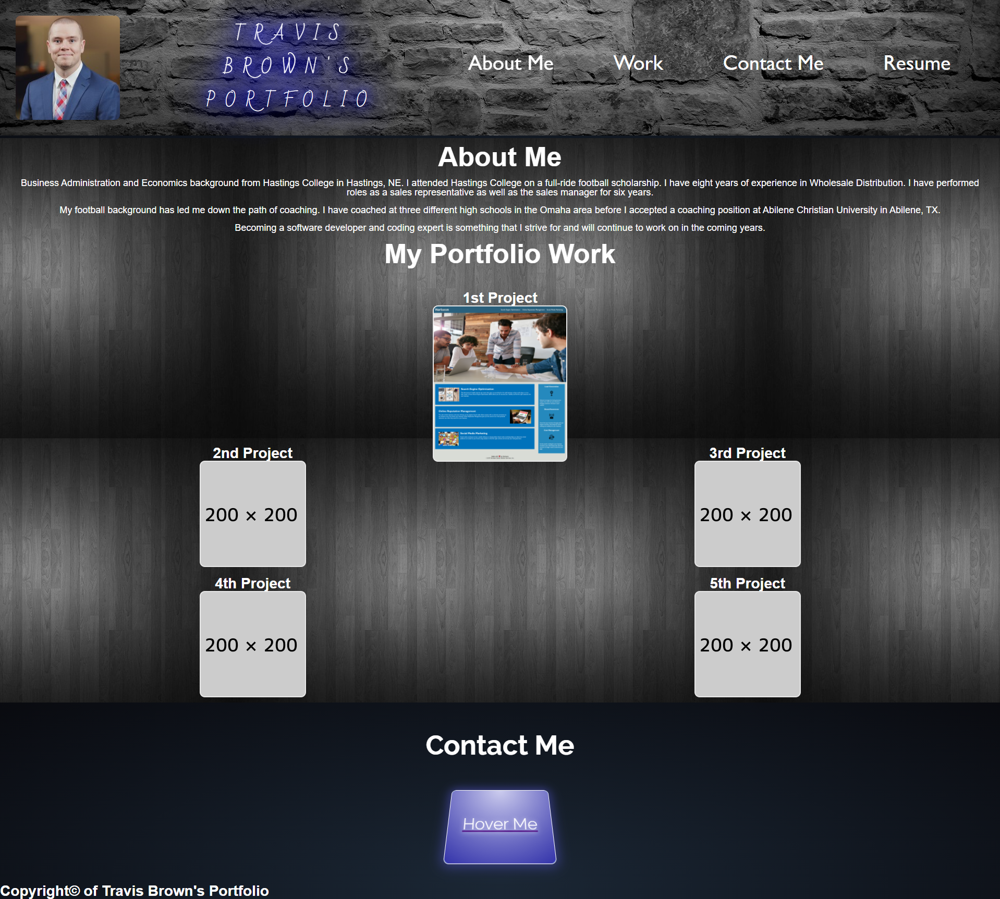

# 02_portfoliohmwrk

# My Portfolio Website

## Project Goal

A portfolio of work can showcase your skills and talents to employers looking to fill a part-time or full-time position. An effective portfolio highlights your strongest work as well as the thought processes behind it. Students who have portfolios with deployed web applications (meaning they are live on the web) are typically very successful in their career search after the boot camp. This last point can’t be stressed enough: having several deployed projects is a minimum requirement to receive an initial interview at many companies.

With these points in mind, in this homework you’ll set yourself up for future success by applying the core skills you've recently learned: flexbox, media queries, and CSS variables. You'll get to practice your new skills while creating something that you will use during your job search. It’s a win-win that you'll likely be grateful for in the future!

This week, you'll build a portfolio page, which you can add to as the course progresses.

## User Story

```
AS AN employer
I WANT to view a potential employee's deployed portfolio of work samples
SO THAT I can review samples of their work and assess whether they're a good candidate for an open position
```

## Acceptance Criteria

Here are the critical requirements necessary to develop a portfolio that satisfies a typical hiring manager’s needs:

```
GIVEN I need to sample a potential employee's previous work
WHEN I load their portfolio
THEN I am presented with the developer's name, a recent photo, and links to sections about them, their work, and how to contact them
WHEN I click one of the links in the navigation
THEN the UI scrolls to the corresponding section
WHEN I click on the link to the section about their work
THEN the UI scrolls to a section with titled images of the developer's applications
WHEN I am presented with the developer's first application
THEN that application's image should be larger in size than the others
WHEN I click on the images of the applications
THEN I am taken to that deployed application
WHEN I resize the page or view the site on various screens and devices
THEN I am presented with a responsive layout that adapts to my viewport
```

## Table of Contents

If your README is long, add a table of contents to make it easy for users to find what they need.

- [Links to Application](#Links)
- [Mock-Up](#Mock-Up)
- [Credits](#credits)
- [License](#license)

## Links

Below are links to access this live website and repository.

Github: https://github.com/bergannation/02_portfoliohmwrk

Deployed URL: https://bergannation.github.io/02_portfoliohmwrk/

## Website Mock-Up

The following image shows the web application's appearance and functionality:

 

## Credits

Amazing Techno Tutorials
https://www.youtube.com/channel/UCX6g7OirMyfEBn5Oxqu-wGA
